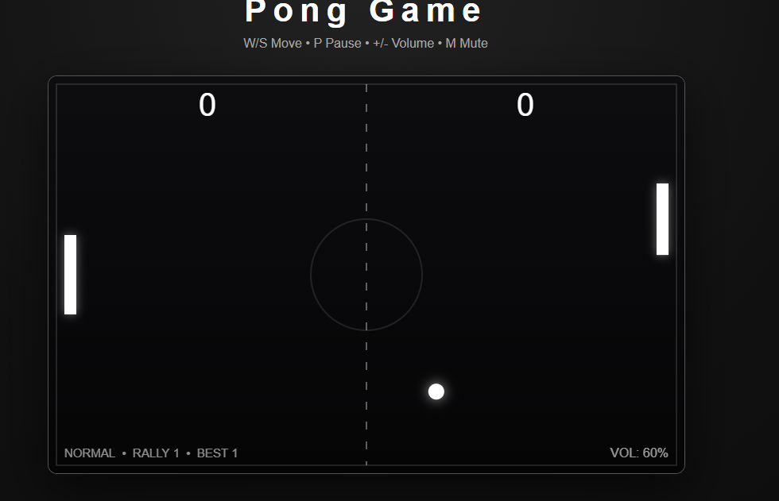
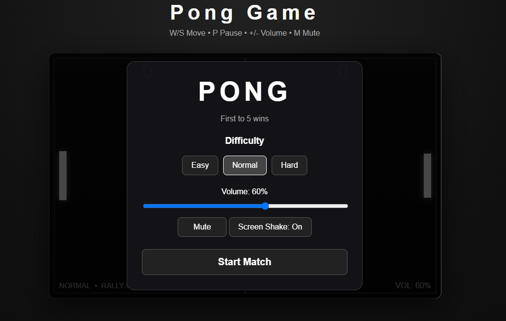
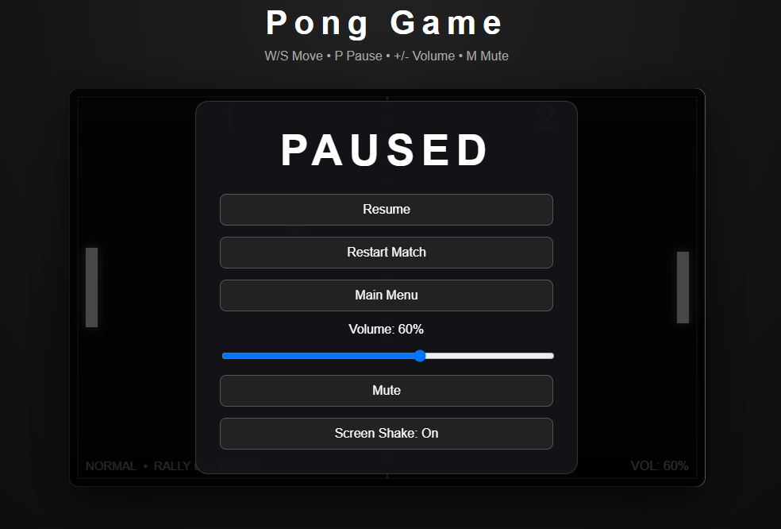
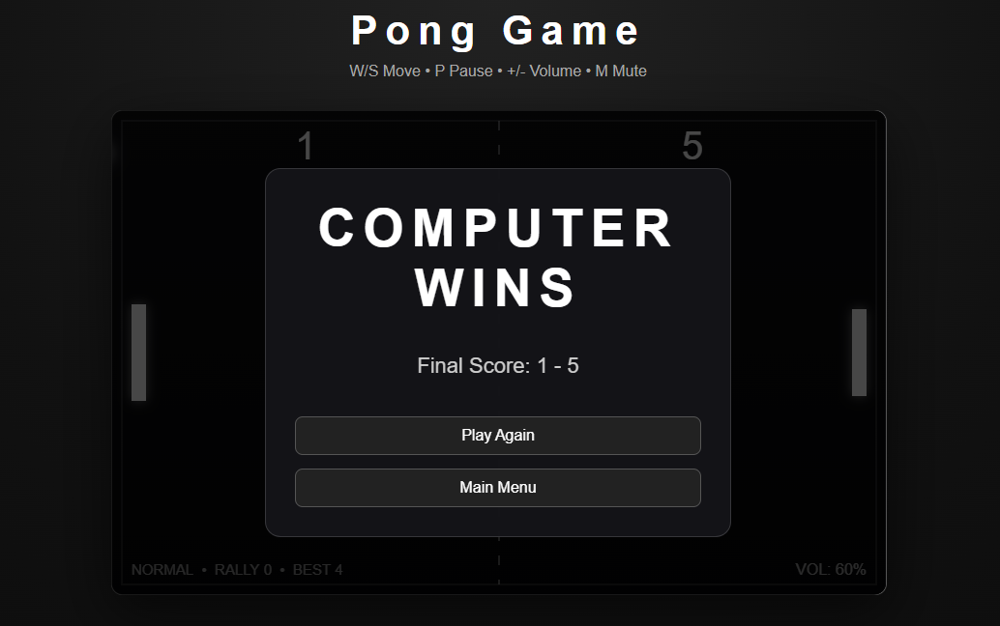

# Pong Game 🏓

A browser-based Pong game built with HTML, CSS, and vanilla JavaScript.

This project started as a programming learning exercise and gradually developed into a more complete game with menus, difficulty settings, sound, visual effects, game states, and configurable options.

## Screenshot

### Menus and Game States

| Main Menu | Pause Menu |
| --- | --- |
|  |  |

## Features

- Player movement with W / S
- Computer-controlled opponent
- Easy, Normal, and Hard difficulty modes
- First to 5 points wins
- Angle-based paddle bouncing
- Ball acceleration during rallies
- Rally and best-rally tracking
- Start menu
- Pause menu
- Restart match
- Game-over screen
- Volume controls
- Mute option
- Sound effects
- Particle effects
- Screen shake
- Screen-shake accessibility toggle
- Automatic pause when the browser loses focus
- Frame-rate-independent movement

## Controls

| Key | Action |
| --- | --- |
| W | Move paddle up |
| S | Move paddle down |
| P | Pause / Resume |
| + | Increase volume |
| - | Decrease volume |
| M | Mute / Unmute |
| Space | Start / Restart |

## What I Learned

While building this project I practiced:

- JavaScript variables, functions, objects, and conditionals
- Keyboard event handling
- HTML Canvas rendering
- Game loops using `requestAnimationFrame`
- Delta time and frame-rate-independent movement
- Collision detection
- Velocity and bounce-angle calculations
- Basic game AI
- Game-state management
- DOM manipulation
- HTML menu overlays
- Web Audio API basics
- Particle effects and screen shake
- Debugging JavaScript and HTML structure
- Refactoring duplicated code
- Testing different game states and user flows

One of the biggest lessons from this project was how small structural mistakes, such as a misplaced brace or HTML closing tag, can affect an entire system.

## Technology

- HTML5
- CSS3
- JavaScript
- HTML Canvas
- Web Audio API

## Development Process

I built this project as part of my programming learning journey.

ChatGPT was used as a development tutor and assistant throughout the project. It helped explain programming concepts, suggest implementation approaches, review bugs, and guide debugging.

I wrote, tested, modified, and debugged the project while learning how each part of the code works.

## Version

**v1.0**

The core Pong project is considered complete. Future work will focus on new projects rather than adding more features to this version.